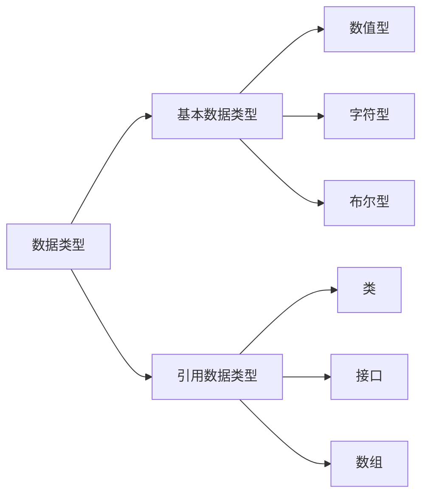

> 分组-放假过后类-课程设计-看视频
> 上机时间4，8，12，15周 地点在一教233

# JAVA基础

- java代码的位置
    - java中所有程序的代码都必须存在于一个类中
- java严格区分大小写
- java是一种自由格式的语言
    - 一条语句可以卸载若干行上，单一句连续的字符串不能分开在两行中
- java程序的三种注释方式
    - 单行注释，多行注释，文档注释

## 文档注释

```java
public class Teacher{
/*
*这是文档注释
*/
public int listen()
}
```
## 标识符和关键字

- 标识符规则：
    - 由字母，数字，下划线和$符组成
    - 以一个字母，下划线（——），$符开头，随之可以是数字
    - 大小写敏感，五最大长度

- 关键字：
    - **true，false，null不是关键字**

## 数据类型


### 基本数据类型和引用数据类型的区别

- 组成
    - 基本数据类型：只包含数值
    - 引用数据类型： 不仅包含数值，还包含怼数值的操作。
- JAVA 虚拟机的处理方式
    - 基本数据类型：根据比那辆的实际类型为其分配内存空间
    - 引用数据类型：在内存空间不是储存引用对象的数据，而是对象在堆内存中存访的地址

### 基本数据类型转换（隐式）

#### 自动类型转换（隐式）

不同类型数据间的有限关系如下：
低--------------------------------------------------->高
byte,shoret,char$\rightarrow$int$\rightarrow$long$\rightarrow$flout$\rightarrow$double

### 强制类型转换（显式）

目标类型变量=（目标类型）值；
高到低；

举例： 

```java
byte b = 122;
int x = b;
b = x;
```

## 常量与变量

- 初始化常量
    - 声明时初始化
    - `final int YOUTH_AGE = 18;`
    - `final int A =3,B= 4,C=5`
    

## 运算符

**短路与运算**`&&`:当表达式左边为假的时候，不用判断右边表达式，直接为假

**短路或运算**`||`:当左边表达式位真时候，不用判断右边表达式，直接为真


## 语句

完全和C一样

### return语句

必须和方法中定义的返回值类型一样，例如

```java
public int set(inta,intb){
    return sum=a+b
} //返回值必须是 int 或者精度更低的类型
```

> **随堂练习**:输出三位数和百位数和个位数对调的函数
> ```java
> public class Change{
>   public static void main(int input){
>       int ge,shi,gai;
>       bai = input/100;
>       ge = input%10;
>       shi = input/10%10;
>       system.out.println(bai+ge*100+shi*10);
>   } 
> }
> ```
> ```java
> public class Count{
>   public static  void main(string[]) 
>    for(i) 


